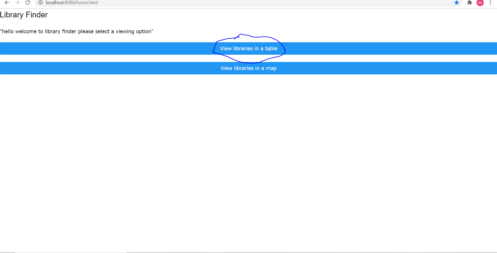
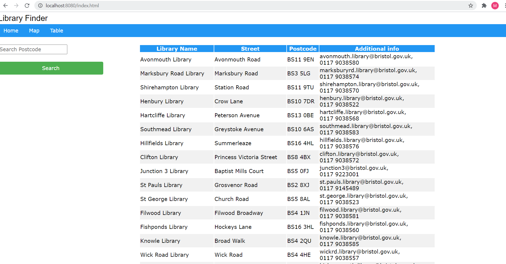
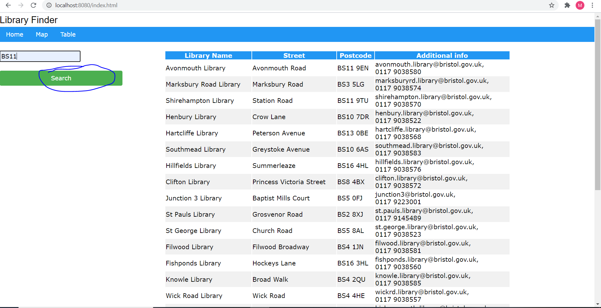
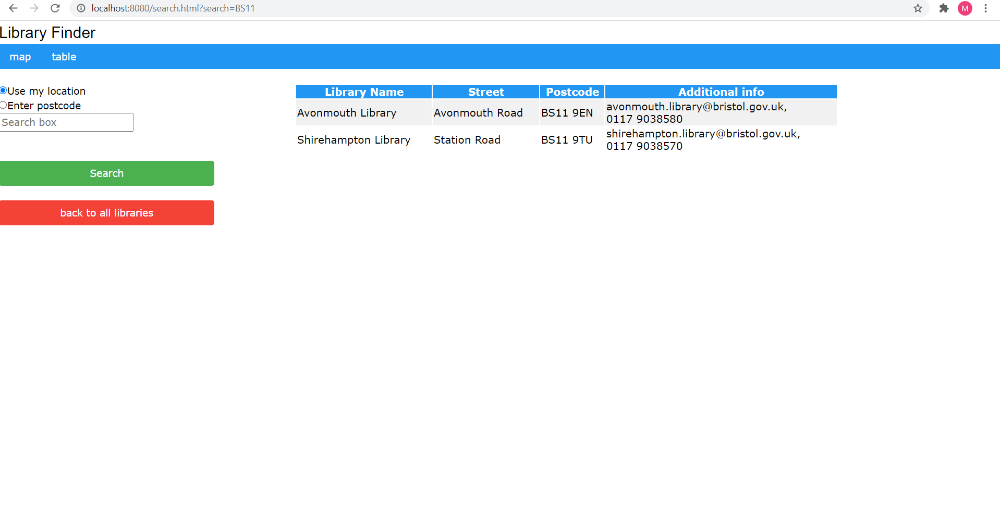

# Deployment

## Release Notes

The current version of the system is v1.0.The system is run on the local server 8080, the software tools used are Express, EJS and MYSQL. The librairyfinder website also has dependencies to all of those tools as they all the website to run as it does. There is one issue with the system as when the 'view in map' option is chosen a message that says "browser doesnt support geo-location" pops up and then the map appears afterwards.

Describe the deployment of software components to hardware nodes using a UML Deployment diagram.

# User guide
UC2 Masud

First step is to select "veiw libraries in table" option 

Then a table with all libraries appears

Optional: You can then search for a library in a particular postcode 

Results will then appear

UC3 Amira

Select the "view libraries in table" option

A table of libraries will appear with additional information which includes phone numbers and email addresses

OR 

Select the "view libraries in a map" option

A map of libraries will appear, click on one of the libraries and the additional information will be displayed

