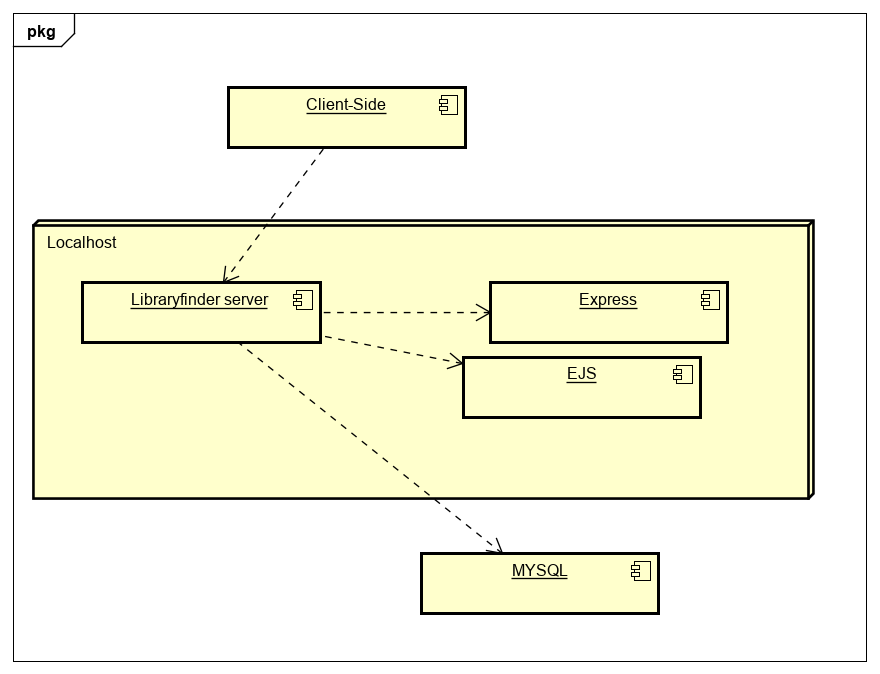

# Deployment

## Release Notes
TODO: Describe the current version of the system (with version number. Include system dependencies ands software tools used.
Are there any known issues? Provide the URL of the deployed system. 
Describe the deployment of software components to hardware nodes using a UML Deployment diagram.

# User guide
TODO: Explain how each use-case works by providing step-by-step screenshots for each use-case. This should be based on a tested scenario.
UC2 Masud 
First step is to select "veiw as table" option 

Then a table with all libraires appears

Optional: You can then search for a library in a particular postcode 

Results with then appear
