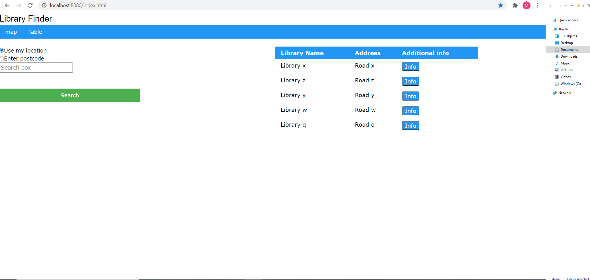
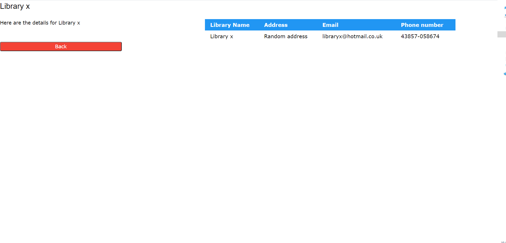

# Design

## Behavioural design
TODO: Describe a concrete scenario for each use-case. 
Describe it in terms of interactions between the components introduces above, and the actors introduced in your requirements.

UC1 - Abdi
The user requests to see a map of libraries. Then the library map finder client will communicate with the server and database through a query. Once this has happened a returned message will give the client a set of libraries, which will then be portrayed on a map for the client.

UC1 - Abdi

UC2 - Masud 
The user can request to see a table of libraries from from the menus.The library finder client will then interact with the database via a query to get the appriopriate data, this could be all libraries or just libraries in a specific postcode. The client then takes this data and puts it into a table fromat for the user to view.

UC2 - Masud 

## User Interface design
TODO: Specify and develop a user interface mockup using an HTML wireframe.

