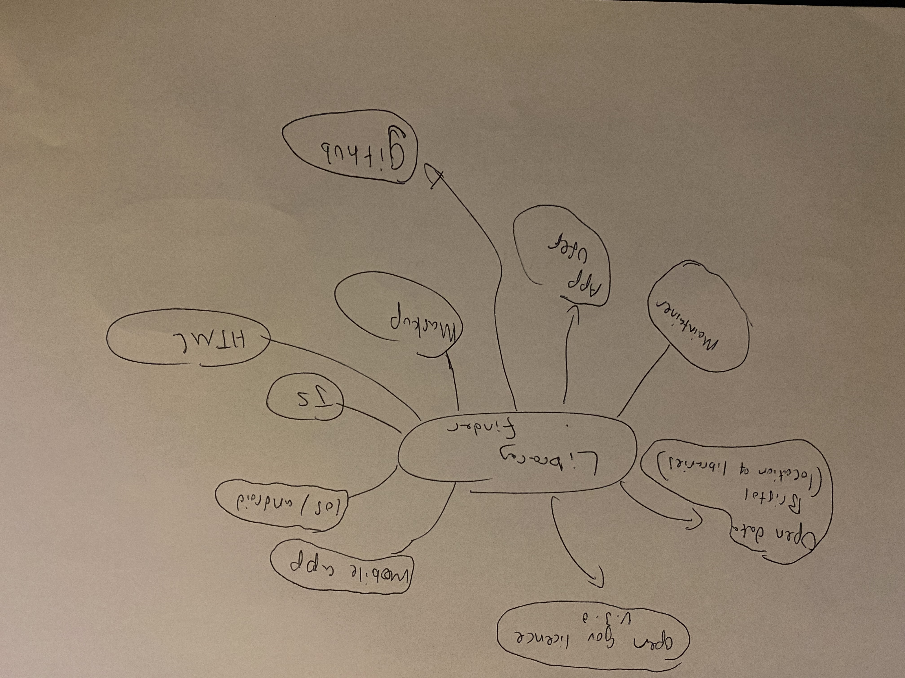

# Library Finder

## Business Case

### Problem statement
Our Project is called library finder. It is an app that allows people to find the nearest library to them based on their location. This addresses a problem that many people have of finding open to use public libraries. Many people go to only one or two libraries and by using this app it will allow them to experience many different libraries. They can find the one that suits them the most based of location, size or facilities in the library e.g., types of computers, silent working spaces and team work spaces. By creating this app library finder, we aim to help everyone find the best libraries for them and make it easier for them to find library spaces that suit their needs.

### Business benefits
Library finder will have many benefits for users including:
1. Finding the closest library can help people with travel costs etc
2. Users can find libraries close to them while on the move.
3. Users can decide if they want to go to that library based on the facilities there.
4. Users can see distances between their current location and their library of choice.

### Options Considered
TODO: What are some other customer options or leading products that address the same needs?
There are no leading mobile apps that specifically find libraries for users, however, google searching libraries near me could address the same needs. However, there are some issues that could arise from this e.g., google could show all libraries including private libraires such as school and university facilities. 

### Expected Risks
TODO: What are the main risks of this project?
One of the risks associated with launching an app is the cost. Apps and websites can be expensive to start up and more expensive to maintain. Another risk associated with launching our app/websites is that it may grow too fast making it difficult to maintain and accommodate possibly hundreds of thousands of users weekly/monthly. This can cause an issue that we cou;d not be prepared for. Another issue is that users may struggle to take to our new app. According to Build fire Mobile App Download and Usage Statistics (2021) the average person only uses 9 apps per day. This is a very small amount, and it may become difficult for our app to become an app the average person uses regularly.

## Project Scope
TODO: Scope of the System of Interest. Include a bullet list of things from your context diagram that are in scope.
The context diagram includes things that are in some way connected to the project this includes:
1. Open data Bristol (library location)
This is the data we have chosen to base our app around. The data includes all the public libraries in Bristol that are open to use to the public, our app will help users use this information to benefit them and their needs.

2. Open government licence v 3.0
This is the licence the libraries data has, it allows people to copy, publish, distribute, and transmit the Information, adapt the Information,
exploit the Information commercially and non-commercially for example, by combining it with other Information, or by including it in your own product or application. This shows that we can use this information for our app, the only thing that we must do is acknowledge the source of the information.

3. HTML/JS/MARKDOWN
These are the three tools we will use to help us make this project.

4. GitHub
This is similar to HTML etc,  however GitHub is slightly different to the others as it is where we can save our work on the project and share it with the other members in the group, where they can then make changes on their local copy then (push it up) for the rest of the people working on the project to see.

5. Mobile style iOS/android
We aim for our library finder app to be available for mobile use as this is what most people will be using when out of their house or just in general. This makes it important for our app to be compatible for both iOS and android so people can use it on their phones. I mention iOS and android in particular as this is what most people use.

6. Person looking for library/app user
This is the person that uses the app

7. Maintainer
This is the person that maintains and makes the app.

## Context Diagram for Library Finder Project

