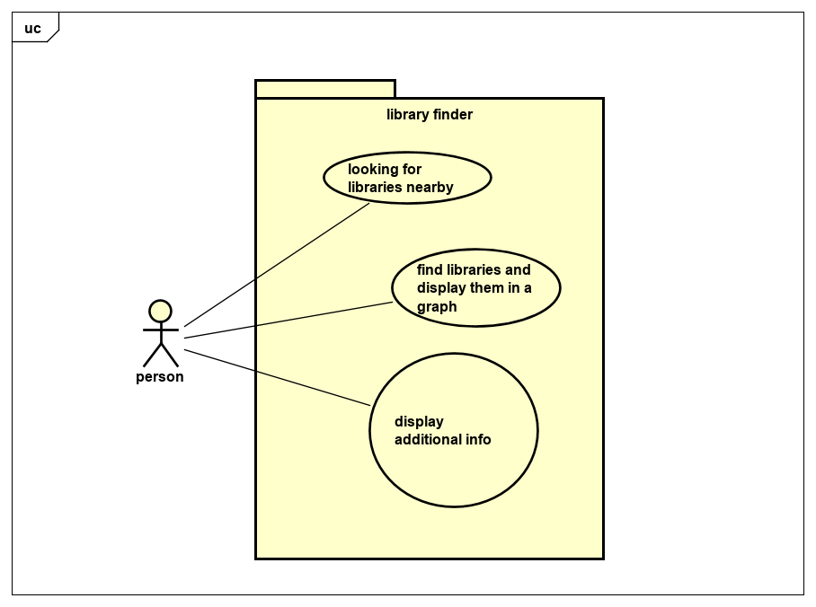

# Requirements

## User Needs

### Actors
TODO: List and describe the actors/users for this product.
The users of this app is anyone that needs to find a library.

### User stories
TODO: Write brief user stories to explain how various actors would interact with the system to accomplish a goal.
    Express these in the form from agile development:- As a (role) I want (goal) so that (benefit). 
    
    As a user of Library finder I want to find a library close to me so i can do some work.
    As a user of library finder I would like to find a library while on the move so i can quickly use a printer there.
    As a user of libray finder I need to find a library closer to me so i can reduce travel costs.

### Use Cases
TODO: Describe each use case (one per team member).
    Give each use case a unique ID, e.g. UC1, UC2, ...
    Summarise these using the use-case template below.

|  USE-CASE  UC1     | find libraires and display them in a graph
| -------------------------------------- | ------------------- |
| **Description**    | Person needs to find the closest library to them |
| **Actors**         | Person (looking for library) |
| **Assumptions**    | browser/ app supports geolocation</td></tr>
| **Steps**          | 1) user asks to see a table of nearest libraires    2)system requests the location of the user  3) user get the nearest libraires   4) system puts the nearest libraires into a table for the user to view |
| **Variations**     | Browser/ app doesnt have geolocation (system can ask for postcode)|
| **Non-functional** | TODO: OPTIONAL - List of non-functional requirements that the use case must meet. |
| **Issues**         | TODO: OPTIONAL - List of issues that remain to be resolved |

|  USE-CASE  UC2    | show additonal details obout library
| -------------------------------------- | ------------------- |
| **Description**    | user wants to find additonal details about a libary |
| **Actors**         | |
| **Assumptions**    | </td></tr>
| **Steps**          | |
| **Variations**     | |
| **Non-functional** | |
| **Issues**         | |

TODO: Your Use-Case diagram should include all use-cases.

## Software Requirements Specification
### Functional requirements
TODO: create a list of functional requirements. 
    e.g. "The system shall ..."
    Give each functional requirement a unique ID. e.g. FR1, FR2, ...
    Indicate which UC the requirement comes from.

   * FR1 The system shall show a menu of available options.
   * FR2 The system shall request the location of the user using geo-location from the browser.
   * FR3 The system shall find the nearest libraries.
   * FR4 The system shall present a table of the nearest libraries. 
   * FR5 The system could  get your location from your postcode if geo location is unavailable. 
   * FR6 The system could have additional details about the libraries email address or phone number. 
   

### Non-Functional Requirements
TODO: Consider one or more [quality attributes](https://en.wikipedia.org/wiki/ISO/IEC_9126) to suggest a small number of non-functional requirements.
Give each non-functional requirement a unique ID. e.g. NFR1, NFR2, ...

Indicate which UC the requirement comes from.
