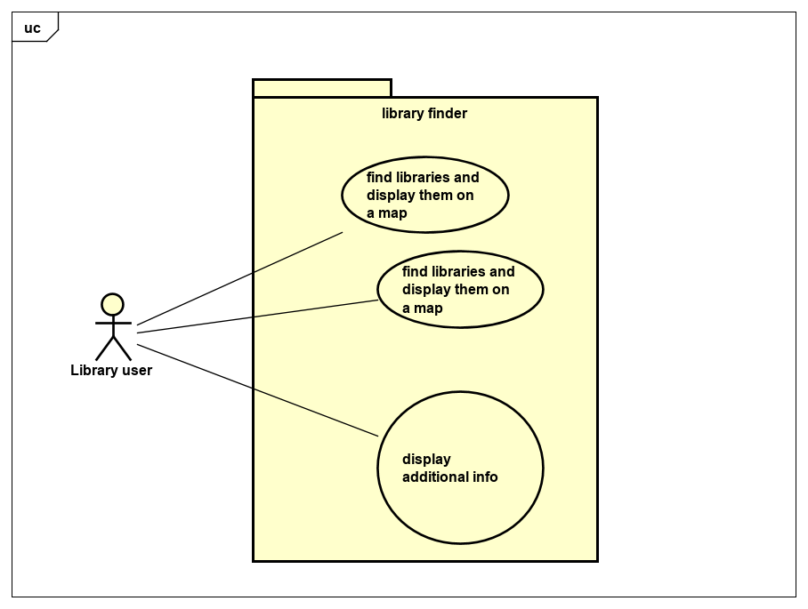

# Requirements

## User Needs

### Actors
The users of this app is anyone that needs to find a library, so library users.

### User stories
TODO: Write brief user stories to explain how various actors would interact with the system to accomplish a goal.
    Express these in the form from agile development:- As a (role) I want (goal) so that (benefit). 
    
    As a user of Library finder I want to find a library close to me so i can do some work.
    As a user of library finder I would like to find a library on a map while on the move so i can quickly use a printer there.
    As a user of libray finder I need to find a library closer to me so i can reduce travel costs.
    As a user of library finder I need to see additional details of the libraries e.g. phone number email etc. 

### Use Cases

|  USE-CASE  UC1   | find library and display them on a map
| -------------------------------------- | ------------------- |
| **Description**    |Map needs to find a library and display on a map |
| **Actors**         |Library user |
| **Assumptions**    | </td></tr>
| **Steps**          |1) User asks to see a map of all libraries. 2) system makes a map with the libraires on available to view. 3) user can view the map with the libraires |
| **Variations**     | |
| **Non-functional** | |
| **Issues**         | |

|  USE-CASE  UC2     | find libraires and display them in a table  - masud 
| -------------------------------------- | ------------------- |
| **Description**    | Library  needs to find a library  |
| **Actors**         | Libarary  user  |
| **Assumptions**    | browser/ app supports geolocation</td></tr>
| **Steps**          | 1) user asks to see a table of libraires     2) user gets a table of libraries   3) system puts the  libraires into a table for the user to view |
| **Variations**     | Browser/ app doesnt have geolocation for table presentation (system can ask for postcode)|
| **Non-functional** |  |
| **Issues**         |  |

|  USE-CASE  UC3  | display additional info about library 
| -------------------------------------- | ------------------- |
| **Description**    | User wants to find additonal details about a library |
| **Actors**         | Library |
| **Assumptions**    | </td></tr>
| **Steps**          | 1) user can see libraries in a map or table and would like additional details 2) system shows details in a column when data is presented in a table and a pop up when presented in a map 3) user is able to see additional details.  |
| **Variations**     | |
| **Non-functional** | |
| **Issues**         | |

TODO: Your Use-Case diagram should include all use-cases.

## Software Requirements Specification
### Functional requirements
TODO: create a list of functional requirements. 
    e.g. "The system shall ..."
    Give each functional requirement a unique ID. e.g. FR1, FR2, ...
    Indicate which UC the requirement comes from.

   * FR1 The system shall show a menu of available options.
   * FR2 The system shall request the location of the user using geo-location from the browser.
   * FR3 The system will be able to request and retrive data from a data base
   * FR4 The system shall present a table of libraries. 
   * FR5 The system could  get your location from your postcode if geo location is unavailable. 
   * FR6 The system will have additional details about the libraries email address or phone number. 
   

### Non-Functional Requirements

Indicate which UC the requirement comes from.
  * NFR1 The system will refresh itself so they accuracy of the results will remain if the user is moving. - <i>- functionality (UC1+UC2)</i>
  * NFR2 The system will be able to run on mulitple browsers  <i> - reliablity (all uc's)</i>
  * NFR3 The system defult will be to only show libraires within a 2 mile distance <i> - Usibilty (UC1+UC2) </i>
  * NFR4 The system will be effcient as there will be a few clicks from the homepage to the results making it easier for the user <i> - efficently (UC1+2)</i>
  * NFR5 The system will incorporate some changeability as both geo-location and postcode entry will be supported <i> - maintainabilty (UC1+2)</i>
  * NFR6 The system will be able to run on both IOS and android aswell as multiple browsers <i> - portabilty all (uc's)</i>

   
